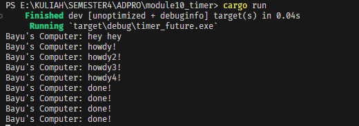

# ADVPROG MODULE 10 - TIMER
## Rizqi Bayu Utama - 2206826330

### 1.2 Understanding How it Works.

    Terlihat bahwa print "hey hey" muncul terlebih dahulu sebelum "howdy!" dan "done!", hal ini terjadi karena "hey hey" tidak berada di dalam asynchronus melainkan di `main`. Selama `Executor` belum memanggil function `run()` maka `spawner.spawn(...)` tidak akan menjalankan tugasnya.

### 1.3 Multiple Spawn and Removing Drop

    Terlihat bahwa program berjalan terus-menerus, hal ini terjadi karena statement drop function tidak dieksekusi sehingga tidak ada penanda untuk `Executor` bahwa tidak ada task lagi yang akan ditambahkan. Terlihat juga urutan printnya tidak berurut, mungkin saja eksekusinya sudah terurut namun bisa dilihat print statementnya tidak dalam urutan yang seharusnya. Karena setiap task yang dibuat menggunakan resource, apabila dibuat banyak maka program akan berjalan lebih lama dan `Executor` akan kesulitan untuk manage banyaknya task.