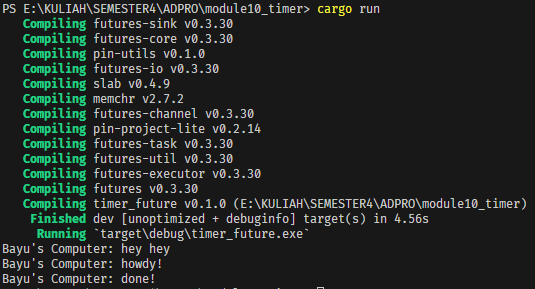

# ADVPROG MODULE 10 - TIMER
## Rizqi Bayu Utama - 2206826330

### 1.2 Understanding How it Works.

    Terlihat bahwa print "hey hey" muncul terlebih dahulu sebelum "howdy!" dan "done!", hal ini terjadi karena "hey hey" tidak berada di dalam asynchronus melainkan di `main`. Selama `Executor` belum memanggil function `run()` maka `spawner.spawn(...)` tidak akan menjalankan tugasnya.